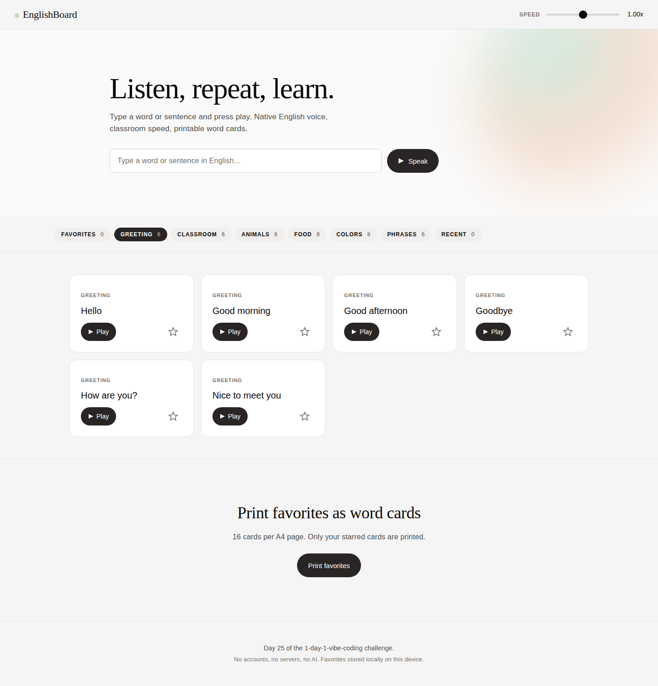

# Day 25 — EnglishBoard (영어 발음 듣기 보드)

> 100일 바이브코딩 챌린지 25일차. 토픽 #025 — *영어 발음 듣기 보드 (English Pronunciation Sound Board).*

교실 TV에 띄워두고, 단어/문장을 입력하면 **한국식이 아닌 영어 native voice**로 즉시 들려주는 사운드 보드.
즐겨찾기, 0.5~1.5x 속도 조절, A4 단어 카드 인쇄까지 지원.

🔗 **Live**: https://989-alt.github.io/project-25-yeongeo-bareum-deutgi-bodeu/



## 핵심 기능

- **TTS 즉시 재생** — Web Speech API. `en-US` / `en-GB` voice 우선, 자동 한국어 회피.
- **카테고리 시드** — Greeting · Classroom · Animals · Food · Colors · Phrases 6개, 총 42개 단어/문장 사전 탑재.
- **즐겨찾기 & Recent** — ★ 토글로 보드에 누적, localStorage 영속. 즉석 입력은 Recent 탭에 자동 누적.
- **속도 슬라이더 0.5–1.5x** — TV에서도 보이는 큰 슬라이더, 실시간 배율 표기.
- **단어 카드 인쇄** — 즐겨찾기만 A4 4×4 = 페이지당 16장. `@media print`로 UI는 숨김.
- **키보드 네비** — Tab으로 카드 포커스 → Space=재생, F=즐겨찾기 토글.

## 어떻게 실행

### 로컬
```bash
git clone https://github.com/989-alt/project-25-yeongeo-bareum-deutgi-bodeu.git
cd project-25-yeongeo-bareum-deutgi-bodeu
python3 -m http.server 5180
# → http://127.0.0.1:5180
```

빌드 단계 없음. CDN 의존 없음. 단일 `index.html` 자기완비.

### 라이브
GitHub Pages: https://989-alt.github.io/project-25-yeongeo-bareum-deutgi-bodeu/

> ⚠ Web Speech API의 사용 가능 voice는 브라우저·OS마다 다릅니다. Chrome / Edge / Safari에서 영어 voice 가장 풍부합니다. Firefox에서는 OS native voice에 의존.

## 기술 스택

- Vanilla HTML/CSS/JS 단일 파일
- Web Speech API (`speechSynthesis`)
- localStorage — 즐겨찾기·Recent
- `@media print` — A4 단어 카드
- 외부 폰트·CDN·API **0개**

## 디자인

브랜드: **ElevenLabs** (음성 AI 브랜드 정렬).

`awesome-design-md/elevenlabs/DESIGN.md`의 토큰 그대로 적용:
- Off-white canvas `#f5f5f5`, warm near-black ink `#0c0a09`
- 디스플레이: serif weight 300 (Waldenburg → Georgia 폴백)
- 본문: system sans
- atmospheric pastel gradient orb (mint → peach) — 재생 중 카드 강조에 동일 톤으로 재활용
- 모든 CTA: pill geometry, ink fill

## 적용한 skill

- `brainstorming` — MUST/SHOULD/MUST NOT 정리 (docs/plans/01-brainstorm.md)
- `ui-ux-pro-max` — 접근성·터치·키보드 체크리스트 보강용
- `senior-devops` — CI/CD는 무시, 코드 품질 원칙만
- `webapp-testing` — Playwright e2e, 15개 시나리오 (tests/test_board.py)

## 테스트

```bash
python3 -m pip install playwright && python3 -m playwright install chromium
cd project-25-yeongeo-bareum-deutgi-bodeu
python3 -m http.server 5180 &
TEST_PORT=5180 python3 tests/test_board.py
```

15개 시나리오 — hero 입력, 카드 재생, 즐겨찾기 영속, 속도 슬라이더, 인쇄 빈상태, 키보드(Space/F), 콘솔 무에러 등. 헤드리스 chromium에는 실제 voice가 없어 `speechSynthesis`는 테스트에서 스텁(`Object.defineProperty`)으로 utterance 캡처.

## 개인정보·금지 기능

- 학생 음성 녹음 / 마이크 권한 요청 **없음**
- AI 발음 평가 **없음**
- 계정·로그인·서버 동기화 **없음**. 100% 로컬 (localStorage).
- 외부 API / 사전 lookup **없음**.

## License

MIT — 교실에서 자유롭게 쓰세요.
